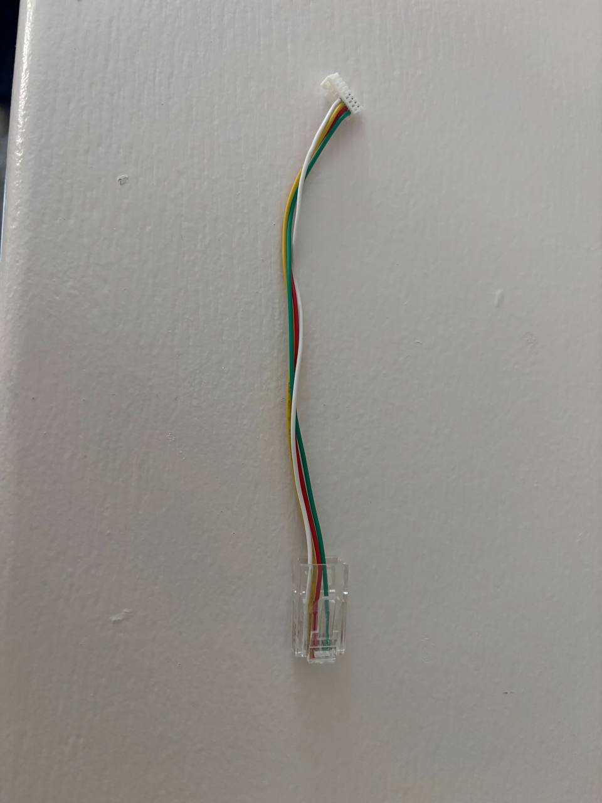
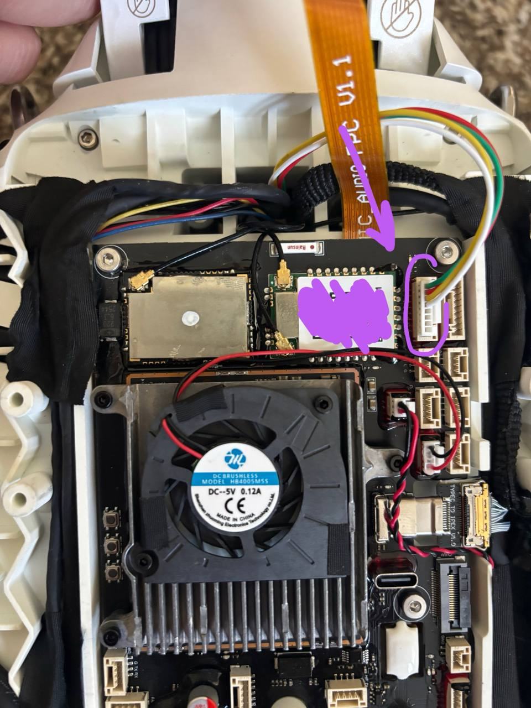

# R1 — add an Ethernet port for secondary development

On the **R1**, the SDK / DDS control link only runs over **Ethernet** (not WiFi). The R1 has no
spare Ethernet jack, so you make one: a small **JST → RJ45 (Ethernet)** adapter that plugs into
the **empty Lidar port** (it carries a spare Ethernet pair).

Once wired, connect any secondary-development PC — laptop, SBC, etc. — and the robot is reachable
at **192.168.123.161**.

## Photos

The JST → RJ45 adapter:



Plugged into the R1's Lidar port on the mainboard (highlighted):



## Adapter pinout

Pin labels for each connector (position 1 → 8):

```
JST:   Rx-  Rx+  Tx-  Tx+  NC  NC  NC  NC
RJ45:  Tx+  Tx-  Rx+  NC   NC  Rx- NC  NC
```

**Wire by matching signal name** (Tx+↔Tx+, Tx−↔Tx−, Rx+↔Rx+, Rx−↔Rx−) — *not* by pin position:

| Signal | JST pin | RJ45 pin |
|:---|:---:|:---:|
| Tx+ | 4 | 1 |
| Tx− | 3 | 2 |
| Rx+ | 2 | 3 |
| Rx− | 1 | 6 |

RJ45 pins 4, 5, 7, 8 are unused.

## Notes & safety

- **Power the robot off** while wiring, and **check continuity with a multimeter** before
  powering anything back on.
- Keep each differential pair twisted together: Tx+/Tx− as one pair, Rx+/Rx− as the other.
- On the PC side use a normal (straight) Ethernet cable — modern NICs auto-detect (Auto-MDIX).
- Set the PC's Ethernet interface onto the robot subnet, e.g. **`192.168.123.100/24`**; the robot
  is **`192.168.123.161`**. Verify with `ping 192.168.123.161`.
- This is a hardware modification you perform at your own risk — see the disclaimer in the
  [README](../README.md).
